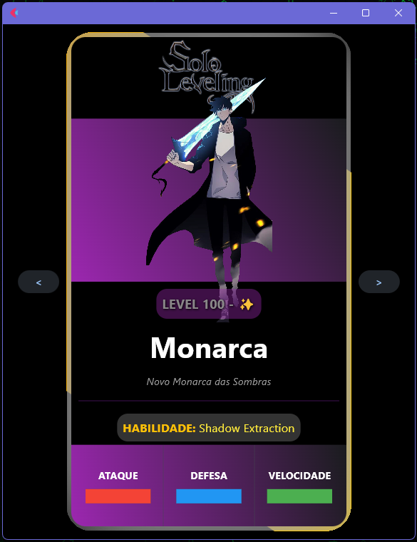
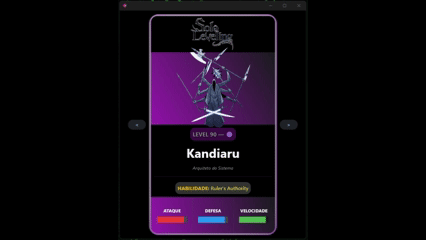

# 🧙‍♂️ Character Cards UI with Flet

An animated, styled interface built with Flet, where you can display character cards with different rarities, animated borders, custom gradients, and progress bars for attributes like attack, defense, speed, and more.



---

## 🚀 Features

- 🟫 Rarity-based card design with color-coded and gradient borders:
  - **Common** – gray
  - **Uncommon** – red
  - **Rare** – blue
  - **Epic** – purple
  - **Legendary** – gold with animated border ✨
- ✨ **Custom gradients for each rarity**
- 🎯 Smooth animations using `AnimatedSwitcher` e `Rotation`
- 📊 Visual **attribute** bars with `ProgressBar`
- 📱 Fully responsive UI, centered layout — ideal for dashboards, RPG apps, or collectible interfaces

---

## 🛠 Tech Stack

- [Flet](https://flet.dev) – Flutter-like UI with Python
- Python 3.10+
- Estilização com gradientes e animações
- Custom UI using `Container`, `Column`, `Stack` and `AnimatedSwitcher`

---

## 📷 Preview



---

## 🧩 How to Run

1. Clone the repository:
```bash
+ git clone https://github.com/Rafael-Melo/cards.git
+ cd cards
```
2. Create and activate a virtual environment:
`python -m venv venv`
`venv\Scripts\activate`

3. Install dependencies:
`pip install flet`

4. Run the project:
`flet run main.py`

📁 Project Structure
📦 cards/
 ┣ 📜 main.py
 ┣ 📁 assets/
 ┃ ┗ 🖼️ character images
 ┗ 📄 README.md

✨ Inspiration
This project was inspired by webtoons like Solo Leveling and card games like Clash Royale, with a focus on smooth UI and customizable visuals for collectible or RPG-style apps.

📄 License 
Distributed under the [MIT](LICENSE).

🤝 Contributions
Contributions are welcome! Feel free to open issues, submit pull requests, or suggest improvements.

Developed with 💻 and passion by Rafael Melo @rafael-melo
